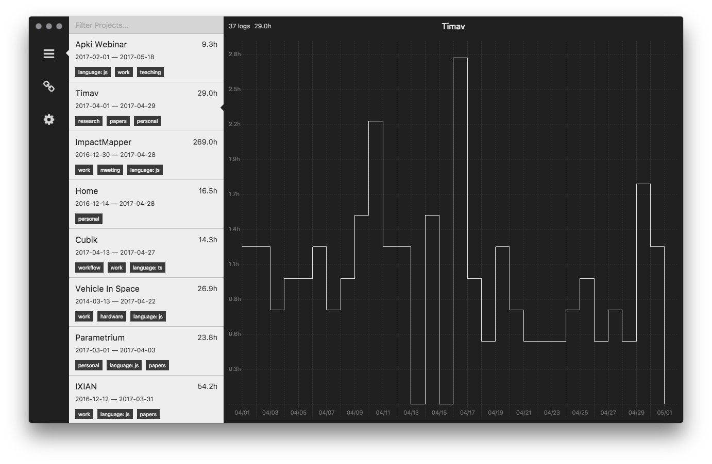

# Timav

## Time Tracking system backed by Google Calendar

Made with [electron](https://electron.atom.io/), [react](https://facebook.github.io/react/), [redux](https://github.com/reactjs/redux) and [immutable](https://facebook.github.io/immutable-js/).

[You should read related blog post with explanation.](http://szymonkaliski.com/blog/2017-04-30-time-tracking/)

Timav is work-in-progress, and is intentend to be a starting point to build your own time tracking solution. I'm happy to merge PRs though!

## Run

1. clone this repo
2. `yarn` or `npm install`
3. create `client-secret.json` (follow *step 1* of https://developers.google.com/google-apps/calendar/quickstart/nodejs, and save file as `client-secret.json` in root directory)
4. `yarn run dev` or `npm run dev` for development, alternatively `yarn start` or `npm start` if you just want to run it
